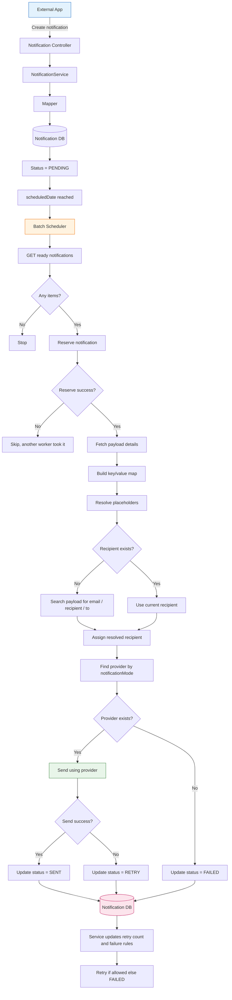

```mermaid
flowchart TD
    A[External App] -->|Create notification| B[Notification Controller]
    B --> C[NotificationService]
    C --> D[Mapper]
    D --> E[(Notification DB)]
    E --> F[Status = PENDING]
    F --> G[scheduledDate reached]
    G --> H[Batch Scheduler]
    H --> I[GET ready notifications]
    I --> J{Any items?}
    J -->|No| Z[Stop]
    J -->|Yes| K[Reserve notification]
    K --> L{Reserve success?}
    L -->|No| M[Skip, another worker took it]
    L -->|Yes| N[Fetch payload details]
    N --> O[Build key/value map]
    O --> P[Resolve placeholders]
    P --> Q{Recipient exists?}
    Q -->|No| R[Search payload for email / recipient / to]
    Q -->|Yes| S[Use current recipient]
    R --> T[Assign resolved recipient]
    S --> T
    T --> U[Find provider by notificationMode]
    U --> V{Provider exists?}
    V -->|No| W[Update status = FAILED]
    V -->|Yes| X[Send using provider]
    X --> Y{Send success?}
    Y -->|Yes| AA[Update status = SENT]
    Y -->|No| AB[Update status = RETRY]
    AA --> AC[(Notification DB)]
    AB --> AC
    W --> AC
    AC --> AD[Service updates retry count and failure rules]
    AD --> AE[Retry if allowed else FAILED]

    style A fill:#E3F2FD,stroke:#1565C0
    style H fill:#FFF3E0,stroke:#EF6C00
    style X fill:#E8F5E9,stroke:#2E7D32
    style AC fill:#FCE4EC,stroke:#C2185B
```
